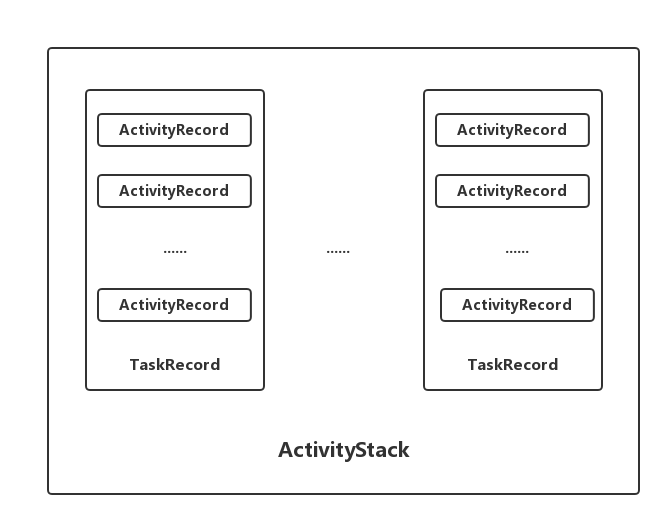

<!-- TOC -->
* [Activity](#activity)
  * [ActivityRecord](#activityrecord)
  * [TaskRecord](#taskrecord)
  * [ActivityStack](#activitystack)
  * [参考](#参考)
<!-- TOC -->

# Activity

AMS主要通过ActivityRecord、TaskRecord、ActivityStack管理Activity

三者关系：

## ActivityRecord

每启动一个activity都会创建一个ActivityRecord

## TaskRecord

任务栈

## ActivityStack

管理任务栈

## 参考

[ActivityRecord、TaskRecord、ActivityStack相互关系以及Activity启动模式](https://blog.csdn.net/Jason_Lee155/article/details/116571487)
[深入理解ActivityRecord、TaskRecord、ActivityStack的作用及关系](https://juejin.cn/post/6856298463119409165)
